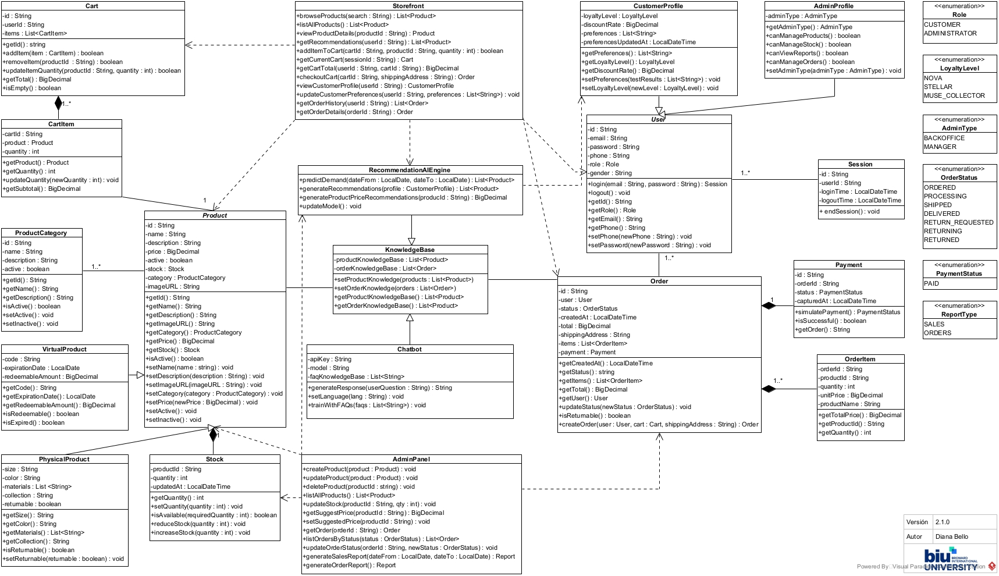

# Ecommerce OOP

## Descripción del proyecto  
**ecommerce-OOP** es el backend de una plataforma de comercio electrónico para la tienda ARCADIA, desarrollada utilizando los principios de la Programación Orientada a Objetos (OOP) e integrando componentes basados en Inteligencia Artificial (IA). 

## Contenido
- [Tecnologías utilizadas](#tecnologías-utilizadas)
- [Implementación](#implementación)
- [Arquitectura](#arquitectura)
  - [Diagrama de clases](#diagrama-de-clases)
  - [Estructura de proyecto](#estructura-de-proyecto)
- [Capturas de pantalla](#capturas-de-pantalla)
- [Instrucciones para ejecutar](#instrucciones-para-ejecutar)
- [Desafíos Enfrentados](#desafíos-enfrentados)
- [Contacto](#contacto)

## Tecnologías utilizadas  
- **Lenguaje**: Java  
- **IDE**: Eclipse IDE con JDK 23
- **Control de versiones**: Git & GitHub  
- **Build**: Sin framework externo actualmemte (Java SE)  

## Implementación
Las clases que se encuentran en el paquete `com.arcadia.ecommerce`:
- `Product`: atributos comunes (id, name, price…) y métodos para obtener datos generales, activar y desactivar.
- `VirtualProduct`: extiende `Product` con código de producto, fecha de expiración y monto canjeable.
- `PhysicalProduct`: extiende `Product` con size, color, materiales, colección y flag `returnable`.
- `User`: gestión de perfiles de usuario, login/logout y enum `Role`.
- `Cart`: operaciones de añadir, remover, actualizar cantidad y calcular total del carrito de compras.
- `CustomerProfile`: extiende `User` con nivel de lealtad (`LoyaltyLevel`), tasa de descuento y preferencias del cliente.  
- `AdminProfile`: extiende `User` con tipo de administrador (`AdminType`) y métodos de permisos.  
- `ProductCategory`: categorías de producto con estado activo/inactivo.  
- `Stock`: control de cantidad en inventario de productos y fecha de última actualización.  
- `Session`: modelo de sesión de usuario con timestamps de inicio y cierre.  
- `CartItem`: articulos en el carrito, subtotal y cantidad.   
- `TestMain`: ejemplos de uso de las clases para prueba.
- `InventoryManager`: interfaz de inventario con métodos `createProduct(Product)`, `updateProduct(Product)`, `deleteProduct(String)`, `listAllProducts()`, `updateStock(String,int)`.  
- `AdminPanel`: implementación de `InventoryManager` que delega en métodos privados `createPhysical(PhysicalProduct)` y `createVirtual(VirtualProduct)`, entre otros pendientes de implementar para la gestión administrativa. 
- `PaymentProcessor`: interfaz para procesos de pago con métodos como `simulatePayment(BigDecimal)`.  
- `CardPayment`: implementa `PaymentProcessor`, y siempre retorna pago exitoso.  
- `Payment`: entidad de registro de transacción con `id`, `orderId`, `status (PaymentStatus)`, `capturedAt`.

Los enums:
- `Role`: tipos básicos de usuario (`CUSTOMER`, `ADMINISTRATOR`).  
- `LoyaltyLevel`: niveles de lealtad de cliente (`NOVA`, `STELLAR`, `MUSE_COLLECTOR`).  
- `AdminType`: tipos de perfil administrador (`BACKOFFICE`, `MANAGER`).
- `PaymentStatus`: estados de pago (`PAID`, `FAILED`).

Patrones de diseño:
- Factory: `EntityFactory`, responsable de instanciar productos físicos o virtuales según el tipo.
- Singleton: `SystemConfig`, clase que asegura una única instancia para almacenar la configuración global del sistema.
- Observer: `OrderStatusNotifier`, permite registrar observadores (`OrderStatusObserver`) y notificar cambios en el estado de los pedidos.

## Arquitectura
### Diagrama de clases  

Nota: Creado con Visual Paradigm Community Edition, por Diana Bello.

### Estructura de proyecto

## Capturas de pantalla 
**Interfaz en Eclipse** 


**Ejecución de TestMain (Semana 2)** 


**Sobrescritura de métodos** 
- Método displayProductInfo() en Product


- Método displayProductInfo() en PhysicalProduct


- Método displayProductInfo() en VirtualProduct


- *Ejecución de ejemplo*


**Sobrecarga de métodos**
- Métodos


- *Ejecución de ejemplo*


**Validación**
- Método mutador setPrice() en Clase Product


- *Ejecución de ejemplo*


**Ejecución de test case**


## Instrucciones para ejecutar
Para ejecutar este proyecto de forma local, siga los pasos a continuación:
1. Clonar repositorio:
   ```bash
   git clone https://github.com/dianaybellom/ecommerce-OOP.git
3. Importar en Eclipse: File → Import → Git → Projects from Git → Clone URI
4. Ejecutar TestMain.java como Java Application.

## Desafíos Enfrentados
- **Asignación 2**:
  - Desafio: El método `removeItem()` de la clase `Cart` no eliminaba correctamente items
  - Solución: Se implementó con `Iterator` para evitar errores de modificación concurrente.
- **Asignación 4**:
  - Desafio: Quise crear una sobrecarga de metodos para additem de esta forma (ver debajo)  pero, no era posible resolver productId a un objeto Product y Eclipse marcaba “product cannot be resolved to a variable”.
   ```java
    public boolean addItem(String productId, int quantity) { }
    ```
  - Solución: Opté por que se reciba directamente un Product y la cantidad, y crear internamente el CartItem.
  ```java
  public boolean addItem(Product product, int quantity) {
      CartItem item = new CartItem(this.id, product, quantity);
      return addItem(item);
  }
  ```
## Contacto
dianabellomejia_@hotmail.com
